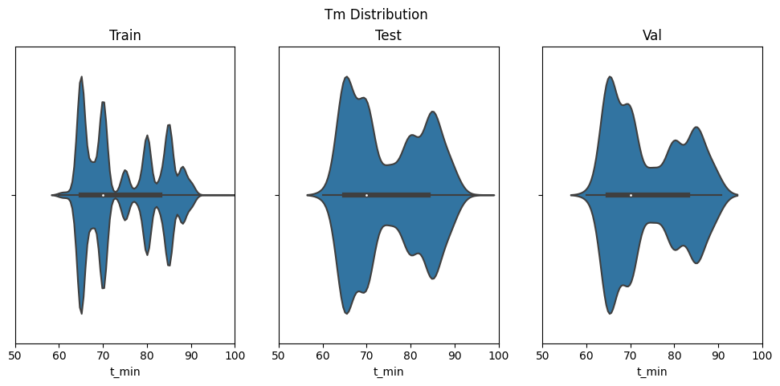
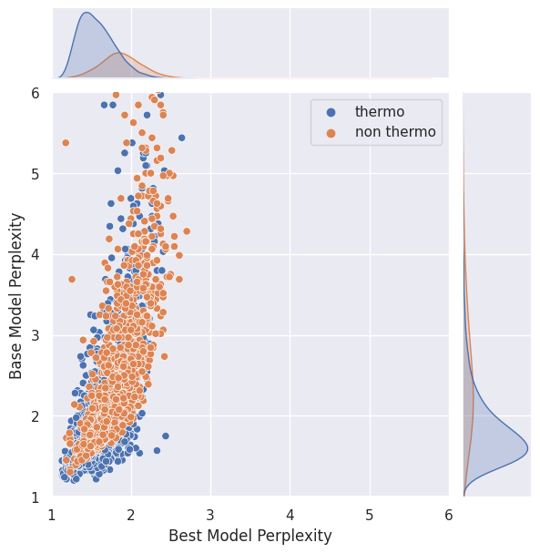

# Mutator

## Dataset
To create the dataset, please refer at the `data/build.ipynb` notebook.

The train/test/val splits contains 85732/2256/2257 proteins with Melting/Minimum Growth temperatures distirbuted according to


## Perplexity shift


## Mutator Training With GeneticAlgorithm
```
# Loading modules
from transformers import AutoTokenizer, AutoModelforMaskedLM
from transformers.adapters import PfeifferInvConfig

from src.mutator import Mutator, MutatorOutput
from src.genetic_algorithm import GeneticAlgorithm as GA

# Setting up the GA trainer
config = PfeifferInvConfig()
tokenizer = AutoTokenizer.from_pretrained("Rostlab/prot_bert_bfd")
model = AutoModelForMaskedLM.from_pretrained("Rostlab/prot_bert_bfd")
model.add_adapter("<adapter_name>", config=config)
model.set_active_adapters("<adapter_name>")

GA.configure(
    Mutator, 
    model, 
    tokenizer, 
    n_mutations=5, 
    k=3, 
    mutation_rate=0.1
)
ga = GA(100, 80)

# Loading the datasets
#TODO

# Training loop
for i in range(10):
    out = ga(
        MutatorOutput.to_fitness, 
        input_ids=input_ids, 
        attention_mask=attention_mask, 
        p_coef=1, 
        d_coef=1
    )
    ga.step()
    ga.zero_fitness()
```